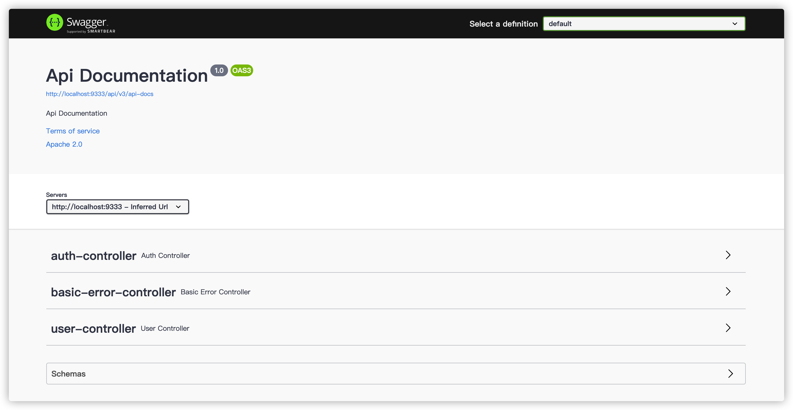
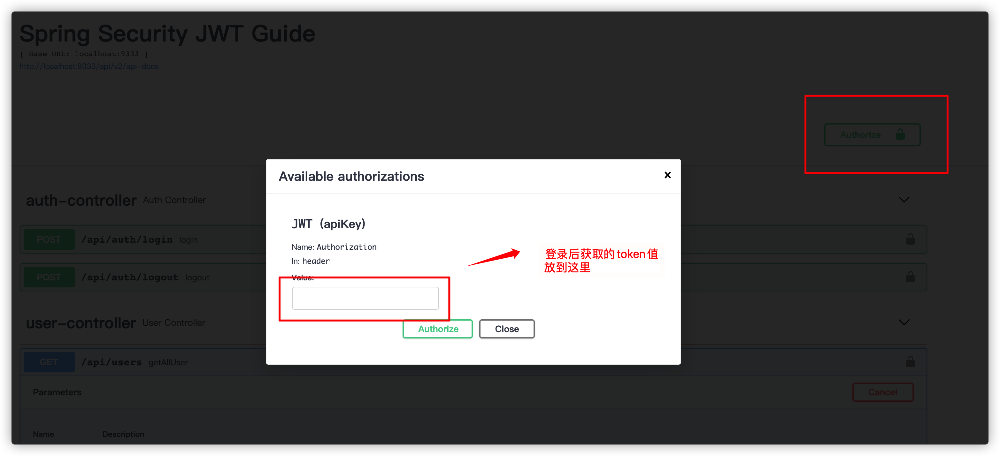
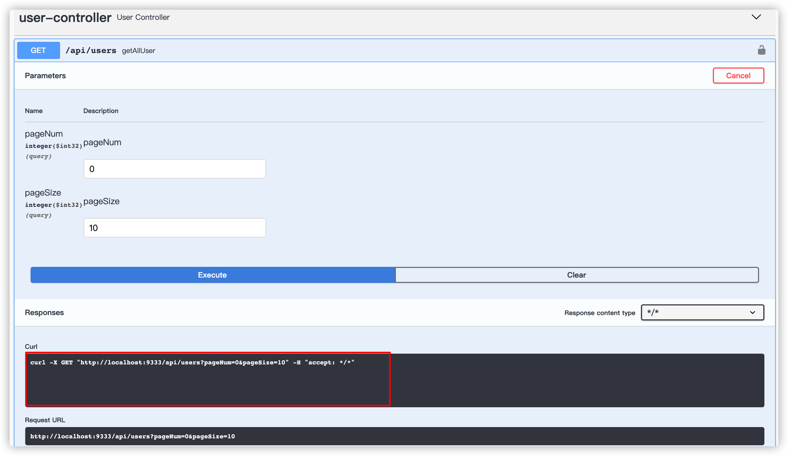
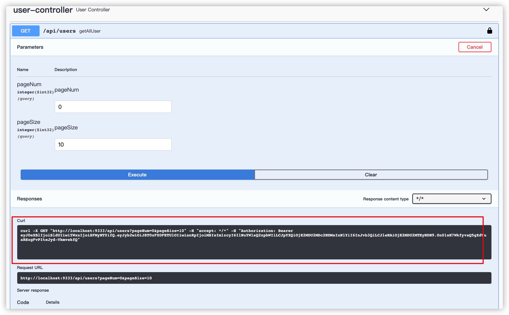
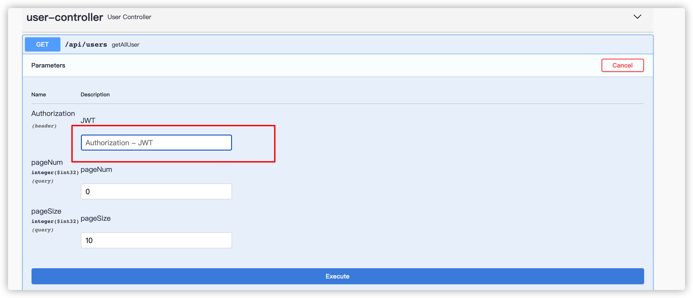

> 可选标题：试试？ Swagger官方 Starter 配上这个增强方案。真的香！

**何为 Swagger ？** 简单来说，Swagger 就是一套基于 OpenAPI 规范构建的开源工具，可以帮助我们设计、构建、记录以及使用 Rest API。

**为何要用 Swagger ?** 前后端分离的情况下，一份Rest API 文档将会极大的提高我们的工作效率。前端小伙伴只需要对照着 Rest API 文档就可以搞清楚一个接口需要的参数以及返回值。通过 Swagger 我们只需要少量注解即可生成一份自带 UI 界面的 Rest API 文档，不需要我们后端手动编写。并且，通过 UI 界面，我们还可以直接对相应的 API 进行调试,省去了准备复杂的调用参数的过程。

这篇文章，我就简单给大家聊聊项目必备的 Swagger 该怎么玩。

这篇文章的主要内容：

1. SpringBoot项目中如何使用？
2. Spring Security项目中如何使用？
3. 使用 knife4j 增强 Swagger

## SpringBoot项目中如何使用？

Swagger3.0官方已经有了自己的 Spring Boot Starter，只需要添加一个 jar 包即可。

```xml
<!-- swagger -->
<dependency>
    <groupId>io.springfox</groupId>
    <artifactId>springfox-boot-starter</artifactId>
    <version>3.0.0</version>
</dependency>
```

什么都不用配置！直接在浏览器中访问 :[http://ip:port/swagger-ui/](http://ip:port/swagger-ui/) 即可。



## Spring Security项目中如何使用？

如果你的项目使用了 Spring Security 做权限认证的话，你需要为 Swagger 相关url添加白名单。

```java
    String[] SWAGGER_WHITELIST = {
            "/swagger-ui.html",
            "/swagger-ui/*",
            "/swagger-resources/**",
            "/v2/api-docs",
            "/v3/api-docs",
            "/webjars/**"
    };

    @Override
    protected void configure(HttpSecurity http) throws Exception {
        http.cors().and()
                // 禁用 CSRF
                .csrf().disable()
                .authorizeRequests()
                // swagger
                .antMatchers(SWAGGER_WHITELIST).permitAll()
          ......
    }
```

另外，某些请求需要认证之后才可以访问，为此，我们需要对 Swagger 做一些简单的配置。

配置的方式非常简单，我提供两种不同的方式给小伙伴们。

1. 登录后自动为请求添加 token。
2. 为请求的Header添加一个认证参数，每次请求的时候，我们需要手动输入 token。

### 登录后自动为请求添加 token

通过这种方式我们只需要授权一次即可使用所有需要授权的接口。




```java
/**
 * @author shuang.kou
 * @description swagger 相关配置
 */
@Configuration
public class SwaggerConfig {

    @Bean
    public Docket createRestApi() {
        return new Docket(DocumentationType.SWAGGER_2)
                .apiInfo(apiInfo())
                .select()
                .apis(RequestHandlerSelectors.basePackage("github.javaguide.springsecurityjwtguide"))
                .paths(PathSelectors.any())
                .build()
                .securityContexts(securityContext())
                .securitySchemes(securitySchemes());
    }

    private List<SecurityScheme> securitySchemes() {
        return Collections.singletonList(new ApiKey("JWT", SecurityConstants.TOKEN_HEADER, "header"));
    }

    private List<SecurityContext> securityContext() {
        SecurityContext securityContext = SecurityContext.builder()
                .securityReferences(defaultAuth())
                .build();
        return Collections.singletonList(securityContext);
    }

    List<SecurityReference> defaultAuth() {
        AuthorizationScope authorizationScope
                = new AuthorizationScope("global", "accessEverything");
        AuthorizationScope[] authorizationScopes = new AuthorizationScope[1];
        authorizationScopes[0] = authorizationScope;
        return Collections.singletonList(new SecurityReference("JWT", authorizationScopes));
    }

    private ApiInfo apiInfo() {
        return new ApiInfoBuilder()
                .title("Spring Security JWT Guide")
                .build();
    }
}
```

**未登录前：**



**登录后：**



### 为请求的Header添加一个认证参数

每次请求的时候，我们需要手动输入 token到指定位置。



```java
@Configuration
public class SwaggerConfig {

    @Bean
    public Docket createRestApi() {
        return new Docket(DocumentationType.SWAGGER_2)
                .apiInfo(apiInfo())
                .select()
                .apis(RequestHandlerSelectors.basePackage("github.javaguide.springsecurityjwtguide"))
                .paths(PathSelectors.any())
                .build()
                .globalRequestParameters(authorizationParameter())
                .securitySchemes(securitySchemes());
    }

    private List<SecurityScheme> securitySchemes() {
        return Collections.singletonList(new ApiKey("JWT", SecurityConstants.TOKEN_HEADER, "header"));
    }

    private List<RequestParameter> authorizationParameter() {
        RequestParameterBuilder tokenBuilder = new RequestParameterBuilder();
        tokenBuilder
                .name("Authorization")
                .description("JWT")
                .required(false)
                .in("header")
                .accepts(Collections.singleton(MediaType.APPLICATION_JSON))
                .build();
        return Collections.singletonList(tokenBuilder.build());
    }

    private ApiInfo apiInfo() {
        return new ApiInfoBuilder()
                .title("Spring Security JWT Guide")
                .build();
    }
}
```

## 使用 knife4j 增强 Swagger

根据官网介绍，knife4j是为Java MVC框架集成Swagger生成Api文档的增强解决方案。

项目地址：[https://gitee.com/xiaoym/knife4j](https://gitee.com/xiaoym/knife4j) 。

使用方式非常简单,添加到相关依赖即可（SpringBoot版本2.3.6.RELEASE，Swagger）。

```xml
<dependency>
    <groupId>com.github.xiaoymin</groupId>
    <artifactId>knife4j-spring-boot-starter</artifactId>
    <version>3.0.2</version>
</dependency>
```

完成之后，访问：[http://ip:port/doc.html](http://ip:port/doc.html) 即可。

效果如下。可以看出，相比于 swagger 原生 ui 确实好看实用了很多。


除了 UI 上的增强之外，knife4j 还提供了一些开箱即用的功能。

比如：**搜索API接口** （`knife4j` 版本>2.0.1 ）


再比如：**导出离线文档**

通过 `Knife4j` 我们可以非常方便地导出 Swagger文档 ，并且支持多种格式。

> - markdown：导出当前逻辑分组下所有接口的Markdown格式的文档
> - Html：导出当前逻辑分组下所有接口的Html格式的文档
> - Word:导出当前逻辑分组下所有接口的Word格式的文档(自2.0.5版本开始)
> - OpenAPI:导出当前逻辑分组下的原始OpenAPI的规范json结构(自2.0.6版本开始)
> - PDF:未实现

以 HTML 格式导出的效果图如下。

